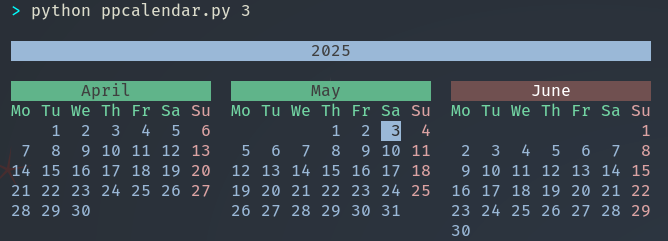

# PPCalendar - Pure Python Calendar



A modern replacement for your system's `cal` command with Python-powered features.

## Installation

```bash
# Recommended (requires uv 0.1.0+):
uv tool install ppcalendar

# Alternative:
pip install ppcalendar
```

## Usage

```bash
# Show current month
ppcal

# Show 3-month view (previous/current/next)
ppcal 3

# Show specific year
ppcal 2025

# Show specific month (June 2024 example)
ppcal 6 2026
```

## Key Features

✨ **Seasonal Colors**  
Months change background by season:
- 🌸 Spring: Green
- ☀️ Summer: Red
- 🍂 Autumn: Yellow
- ❄️ Winter: Blue

📅 **Multiple Views**
- Single month (default)
- 3-month context view
- Full year overview
- Specific month/year

🔄 **Drop-in Replacement**  
Add to your shell config:
```bash
alias cal='ppcal'  # Add to ~/.bashrc or ~/.zshrc
```

## Why PPCalendar?

| Feature       | System `cal` | PPCalendar |
|--------------|-------------|------------|
| Colors       | ❌ No        | ✅ Yes      |
| Today Highlight | ✅ Yes    | ✅ Reverse video |
| 3-Month View | ❌ ✅ Yes   | ✅ Yes      |
| Month/Year   | ❌ YYYY-MM  | ✅ MM YYYY  |
| Locale Support | Limited   | ✅ Full     |

## For Developers

```python
from ppcalendar import cal

# All these work like the CLI:
cal()           # Current month
cal(3)          # 3-month view
cal(2025)       # Year view
cal(6, 2024)    # June 2024
```

## Contributing

We welcome contributions! Here's how to help:

1. Report bugs or suggest features in Issues
2. Submit Pull Requests for:
   - Holiday markers 🎄
   - Week numbers 🔢
   - Moon phases 🌕
3. Improve test coverage

```bash
# Development setup:
git clone https://github.com/yourusername/PPCalendar.git
cd PPCalendar
pip install -e '.[dev]'
```

## FAQ

**Q: Why not call it just `cal`?**  
A: Avoids conflicts with system commands. Use `alias cal='ppcal'` if desired.

**Q: How to uninstall?**  
```bash
uv tool uninstall ppcalendar  # or pip uninstall ppcalendar
```

**Q: Windows support?**  
✅ Yes! Works in all terminals that support ANSI colors.

---

*"The Unix philosophy meets Python beauty"*  

– For terminal lovers who appreciate design

